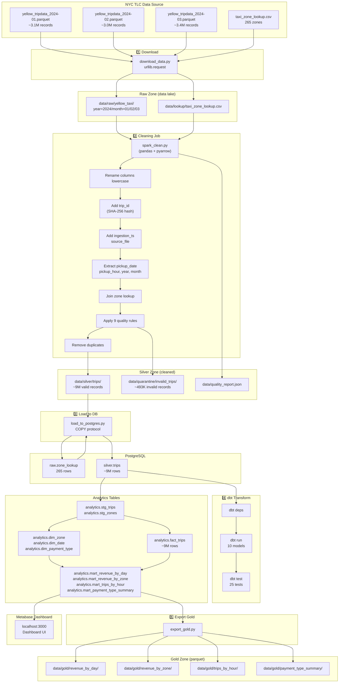
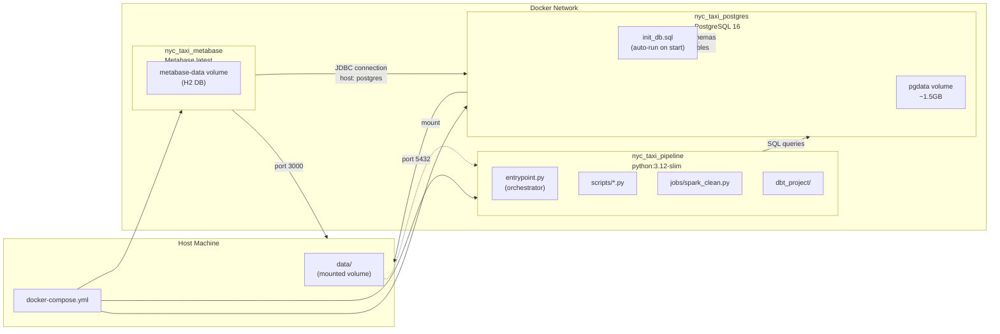
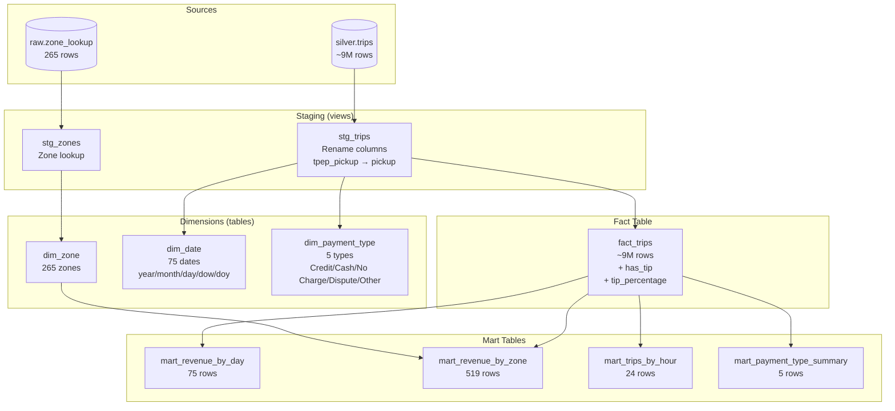
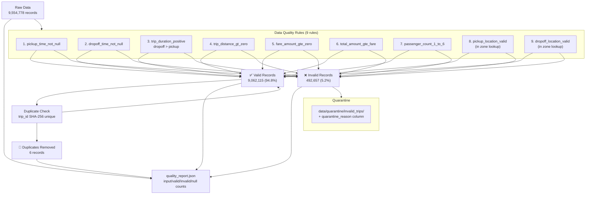
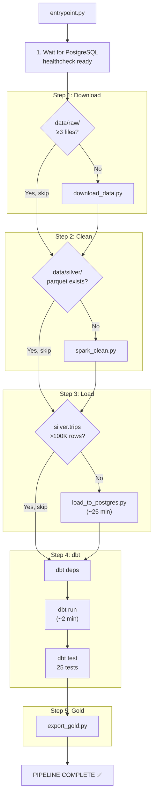
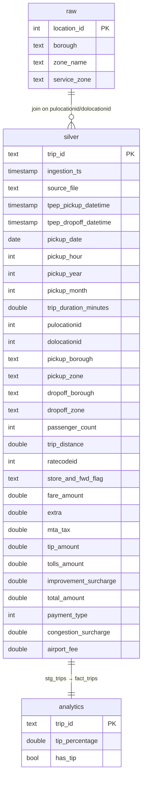

# NYC Taxi Data Pipeline — Luồng chạy

## 1. Luồng tổng quan (Overview Flow)

---

## 2. Docker Infrastructure

---

## 3. dbt Model DAG

---

## 4. Data Quality Pipeline

---

## 5. Entry Point Flow

---

## 6. PostgreSQL Schema

